# Ceph-Exporter 项目架构和流程详解

> 本文档详细介绍 ceph-exporter 项目的整体架构、局部架构、流程图和时序图。
> 所有图表使用 Mermaid 语法，可在支持 Mermaid 的 Markdown 编辑器（如 VS Code + Mermaid 插件、Typora）中渲染。
> 为了帮助初学者理解，每个部分都包含了尽可能详细的注释和说明。

---

## 目录

1. [项目概述](#1-项目概述)
2. [项目目录结构](#2-项目目录结构)
3. [整体架构图](#3-整体架构图)
4. [局部架构图](#4-局部架构图)
5. [整体流程图](#5-整体流程图)
6. [局部流程图](#6-局部流程图)
7. [整体时序图](#7-整体时序图)
8. [局部时序图](#8-局部时序图)
9. [关键数据结构详解](#9-关键数据结构详解)
10. [Prometheus 指标完整清单](#10-prometheus-指标完整清单)
11. [配置系统详解](#11-配置系统详解)
12. [技术栈与依赖](#12-技术栈与依赖)

---

## 1. 项目概述

### 1.1 这个项目是做什么的？

**ceph-exporter** 是一个 **Ceph 集群 Prometheus 指标导出器**。简单来说，它做三件事：

1. **连接 Ceph 集群**：通过 RADOS 协议连接到 Ceph 存储集群
2. **采集监控数据**：定期执行 Ceph 命令（如 `ceph status`），获取集群状态
3. **转换并暴露指标**：将数据转换为 Prometheus 格式，通过 HTTP `/metrics` 端点暴露

### 1.2 为什么需要它？

Ceph 集群本身不直接支持 Prometheus 格式。ceph-exporter 充当"翻译器"：

```
Ceph 集群 (JSON) --> ceph-exporter (翻译) --> Prometheus (存储) --> Grafana (展示)
```

### 1.3 核心技术栈

| 技术 | 用途 | 说明 |
|------|------|------|
| Go 1.21 | 编程语言 | 高性能编译型语言 |
| go-ceph/rados | Ceph 连接 | Go 的 Ceph RADOS C 库绑定（需要 CGO） |
| prometheus/client_golang | 指标导出 | Prometheus 官方 Go 客户端 |
| logrus | 结构化日志 | 支持 JSON 格式、Hook 机制 |
| lumberjack | 日志轮转 | 按大小/数量/天数自动轮转日志文件 |
| OpenTelemetry | 分布式追踪 | 云原生可观测性标准 |
| Jaeger | 追踪后端 | 追踪数据存储和可视化 |
| Docker | 容器化 | 多阶段构建，生产级镜像 |

### 1.4 项目特点

- **7 个专用采集器**：覆盖集群、存储池、OSD、Monitor、健康状态、MDS、RGW
- **完整可观测性**：指标 + 日志 + 追踪 三位一体
- **插件系统**：支持第三方存储系统监控扩展
- **生产就绪**：优雅关闭、健康检查、TLS 支持、日志轮转

---

## 2. 项目目录结构

```
ceph-exporter/                          # 项目根目录
├── cmd/                                # 【命令入口目录】
│   └── ceph-exporter/
│       └── main.go                     # ★ 程序主入口（启动、初始化、优雅关闭）
│
├── internal/                           # 【内部包目录】（Go 编译器禁止外部导入）
│   ├── ceph/                           #   ★ Ceph 客户端模块
│   │   ├── client.go                   #     核心：连接管理、命令执行、数据结构定义
│   │   ├── conn_cgo.go                 #     RADOS 连接实现（CGO 调用 C 库）
│   │   └── testing.go                  #     测试辅助（Mock 连接）
│   │
│   ├── collector/                      #   ★ Prometheus 采集器模块（7 个采集器）
│   │   ├── collector.go                #     公共定义：命名空间、超时、辅助函数
│   │   ├── cluster.go                  #     集群采集器：容量、IO、PG、OSD/Mon 概览（15 个指标）
│   │   ├── pool.go                     #     存储池采集器：每池容量、对象数、IO（9 个指标/池）
│   │   ├── osd.go                      #     OSD 采集器：状态、容量、延迟（9 个指标/OSD）
│   │   ├── monitor.go                  #     Monitor 采集器：仲裁、时钟偏移、延迟（4 个指标/Mon）
│   │   ├── health.go                   #     健康采集器：状态码、检查项（4 个指标）
│   │   ├── mds.go                      #     MDS 采集器：active/standby 状态（3 个指标）
│   │   └── rgw.go                      #     RGW 采集器：网关状态（3 个指标）
│   │
│   ├── config/                         #   ★ 配置管理模块
│   │   ├── config.go                   #     结构体定义、默认值、验证
│   │   └── loader.go                   #     YAML 加载、环境变量覆盖
│   │
│   ├── server/                         #   ★ HTTP 服务器模块
│   │   └── server.go                   #     路由、追踪中间件、健康检查
│   │
│   ├── logger/                         #   ★ 日志模块
│   │   ├── logger.go                   #     结构化日志、轮转、输出
│   │   └── logstash_hook.go            #     ELK 集成（Logstash TCP/UDP 推送）
│   │
│   ├── tracer/                         #   ★ 分布式追踪模块
│   │   └── tracer.go                   #     OpenTelemetry + Jaeger
│   │
│   └── plugin/                         #   ★ 插件系统模块
│       ├── interface.go                #     接口定义（Plugin、CollectorPlugin、StoragePlugin）
│       ├── manager.go                  #     管理器：注册、启动、停止、健康检查
│       └── http_plugin.go             #     HTTP 远程插件支持
│
├── configs/                            # 【配置文件】
│   ├── ceph-exporter.yaml              #   主配置文件
│   └── ceph-exporter.zh-CN.yaml        #   中文注释版配置
│
├── deployments/                        # 【部署文件】
│   ├── docker-compose.yml              #   Docker Compose 编排
│   ├── prometheus/                     #   Prometheus 配置和告警规则
│   ├── grafana/                        #   Grafana 仪表盘
│   └── alertmanager/                   #   告警通知配置
│
├── Dockerfile                          #   多阶段 Docker 构建
├── Makefile                            #   构建自动化
└── go.mod                              #   Go 模块依赖
```

> **设计说明**：遵循 Go 标准项目布局。`cmd/` 放入口，`internal/` 放内部逻辑（外部不可导入），`configs/` 放配置模板。

---

## 3. 整体架构图

### 3.1 系统全景架构

<!-- 注释：这张图展示了 ceph-exporter 在整个监控体系中的位置 -->
<!-- 它连接 Ceph 集群获取数据，转换后提供给 Prometheus，最终在 Grafana 展示 -->

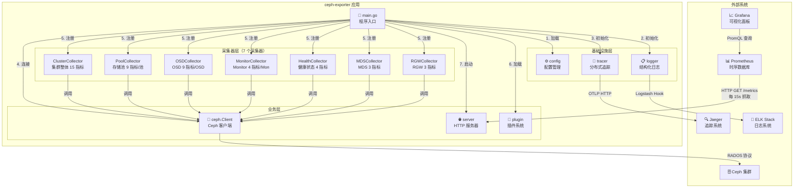
```mermaid
graph TB
    subgraph "外部系统"
        CEPH["🗄️ Ceph 集群"]
        PROM["📊 Prometheus<br/>时序数据库"]
        GRAFANA["📈 Grafana<br/>可视化面板"]
        JAEGER["🔍 Jaeger<br/>追踪系统"]
        ELK["📝 ELK Stack<br/>日志系统"]
    end

    subgraph "ceph-exporter 应用"
        MAIN["🚀 main.go<br/>程序入口"]

        subgraph "基础设施层"
            CONFIG["⚙️ config<br/>配置管理"]
            LOGGER["📋 logger<br/>结构化日志"]
            TRACER["🔗 tracer<br/>分布式追踪"]
        end

        subgraph "业务层"
            CLIENT["🔌 ceph.Client<br/>Ceph 客户端"]
            SERVER["🌐 server<br/>HTTP 服务器"]
            PLUGINS["🧩 plugin<br/>插件系统"]
        end

        subgraph "采集器层（7 个采集器）"
            C1["ClusterCollector<br/>集群整体 15 指标"]
            C2["PoolCollector<br/>存储池 9 指标/池"]
            C3["OSDCollector<br/>OSD 9 指标/OSD"]
            C4["MonitorCollector<br/>Monitor 4 指标/Mon"]
            C5["HealthCollector<br/>健康状态 4 指标"]
            C6["MDSCollector<br/>MDS 3 指标"]
            C7["RGWCollector<br/>RGW 3 指标"]
        end
    end

    MAIN -->|"1. 加载"| CONFIG
    MAIN -->|"2. 初始化"| LOGGER
    MAIN -->|"3. 初始化"| TRACER
    MAIN -->|"4. 连接"| CLIENT
    MAIN -->|"5. 注册"| C1 & C2 & C3 & C4 & C5 & C6 & C7
    MAIN -->|"6. 加载"| PLUGINS
    MAIN -->|"7. 启动"| SERVER

    CLIENT -->|"RADOS 协议"| CEPH
    C1 & C2 & C3 & C4 & C5 & C6 & C7 -->|"调用"| CLIENT
    PROM -->|"HTTP GET /metrics<br/>每 15s 抓取"| SERVER
    GRAFANA -->|"PromQL 查询"| PROM
    TRACER -->|"OTLP HTTP"| JAEGER
    LOGGER -->|"Logstash Hook"| ELK
```

### 3.2 分层架构

<!-- 注释：这张图展示了代码的分层关系 -->
<!-- 上层依赖下层，下层不依赖上层，同层尽量不互相依赖 -->

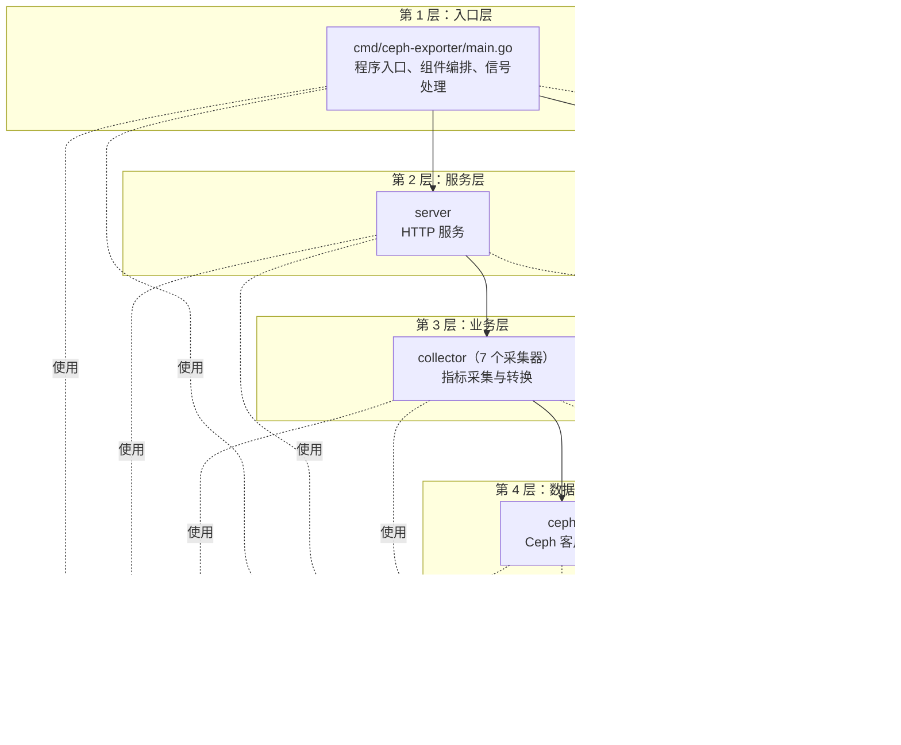
```mermaid
graph TD
    subgraph "第 1 层：入口层"
        L1["cmd/ceph-exporter/main.go<br/>程序入口、组件编排、信号处理"]
    end

    subgraph "第 2 层：服务层"
        L2A["server<br/>HTTP 服务"]
        L2B["plugin<br/>插件管理"]
    end

    subgraph "第 3 层：业务层"
        L3["collector（7 个采集器）<br/>指标采集与转换"]
    end

    subgraph "第 4 层：数据层"
        L4["ceph<br/>Ceph 客户端"]
    end

    subgraph "第 5 层：基础设施层（横切关注点）"
        L5A["config 配置"]
        L5B["logger 日志"]
        L5C["tracer 追踪"]
    end

    L1 --> L2A & L2B
    L2A --> L3
    L3 --> L4
    L1 & L2A & L3 & L4 -.->|"使用"| L5A & L5B & L5C
```

| 层级 | 名称 | 职责 | 关键文件 |
|------|------|------|----------|
| 第 1 层 | 入口层 | 启动、编排、信号处理、优雅关闭 | `cmd/ceph-exporter/main.go` |
| 第 2 层 | 服务层 | HTTP 端点、插件管理 | `internal/server/`、`internal/plugin/` |
| 第 3 层 | 业务层 | 指标采集和 Prometheus 格式转换 | `internal/collector/`（7 个文件） |
| 第 4 层 | 数据层 | 与 Ceph 集群通信 | `internal/ceph/` |
| 第 5 层 | 基础设施层 | 配置、日志、追踪 | `internal/config/`、`logger/`、`tracer/` |

---

## 4. 局部架构图

### 4.1 Ceph 客户端模块架构

<!-- 注释：Ceph 客户端是整个项目的数据来源 -->
<!-- 它通过 RADOS 协议连接 Ceph 集群，执行命令获取 JSON 数据 -->
<!-- 使用接口抽象（radosConn）使得测试时可以用 Mock 替代真实连接 -->

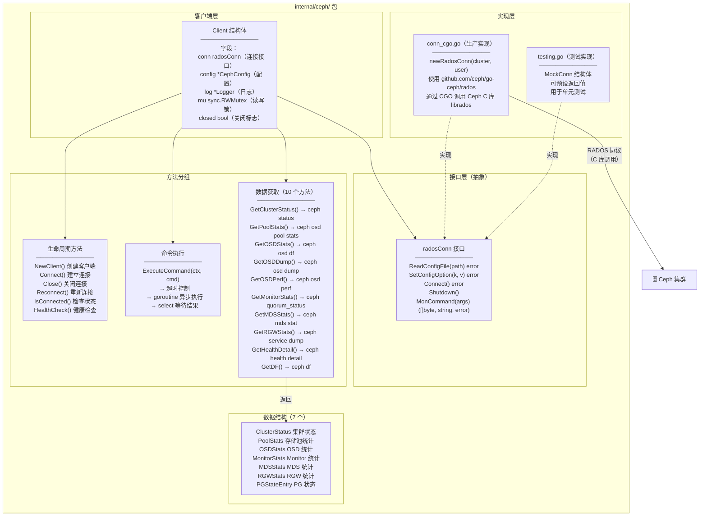
```mermaid
graph TB
    subgraph "internal/ceph/ 包"
        subgraph "接口层（抽象）"
            IFACE["radosConn 接口<br/>──────────────<br/>ReadConfigFile(path) error<br/>SetConfigOption(k, v) error<br/>Connect() error<br/>Shutdown()<br/>MonCommand(args) ([]byte, string, error)"]
        end

        subgraph "实现层"
            CGO["conn_cgo.go（生产实现）<br/>──────────────<br/>newRadosConn(cluster, user)<br/>使用 github.com/ceph/go-ceph/rados<br/>通过 CGO 调用 Ceph C 库 librados"]
            MOCK["testing.go（测试实现）<br/>──────────────<br/>MockConn 结构体<br/>可预设返回值<br/>用于单元测试"]
        end

        subgraph "客户端层"
            CLIENT["Client 结构体<br/>──────────────<br/>字段：<br/>  conn radosConn（连接接口）<br/>  config *CephConfig（配置）<br/>  log *Logger（日志）<br/>  mu sync.RWMutex（读写锁）<br/>  closed bool（关闭标志）"]
        end

        subgraph "方法分组"
            LIFE["生命周期方法<br/>──────────────<br/>NewClient() 创建客户端<br/>Connect() 建立连接<br/>Close() 关闭连接<br/>Reconnect() 重新连接<br/>IsConnected() 检查状态<br/>HealthCheck() 健康检查"]

            CMD["命令执行<br/>──────────────<br/>ExecuteCommand(ctx, cmd)<br/>  → 超时控制<br/>  → goroutine 异步执行<br/>  → select 等待结果"]

            DATA["数据获取（10 个方法）<br/>──────────────<br/>GetClusterStatus() → ceph status<br/>GetPoolStats() → ceph osd pool stats<br/>GetOSDStats() → ceph osd df<br/>GetOSDDump() → ceph osd dump<br/>GetOSDPerf() → ceph osd perf<br/>GetMonitorStats() → ceph quorum_status<br/>GetMDSStats() → ceph mds stat<br/>GetRGWStats() → ceph service dump<br/>GetHealthDetail() → ceph health detail<br/>GetDF() → ceph df"]
        end

        subgraph "数据结构（7 个）"
            DS["ClusterStatus 集群状态<br/>PoolStats 存储池统计<br/>OSDStats OSD 统计<br/>MonitorStats Monitor 统计<br/>MDSStats MDS 统计<br/>RGWStats RGW 统计<br/>PGStateEntry PG 状态"]
        end
    end

    CLIENT --> IFACE
    CGO -.->|"实现"| IFACE
    MOCK -.->|"实现"| IFACE
    CLIENT --> LIFE & CMD & DATA
    DATA -->|"返回"| DS

    CEPH["🗄️ Ceph 集群"]
    CGO -->|"RADOS 协议<br/>（C 库调用）"| CEPH
```

**关键设计点：**

1. **接口抽象**：`radosConn` 接口让生产代码和测试代码可以使用不同的实现
2. **线程安全**：`sync.RWMutex` 读写锁，读操作用 `RLock`（允许并发读），写操作用 `Lock`（独占）
3. **超时控制**：`ExecuteCommand` 用 `context.WithTimeout` + goroutine + select 实现超时
4. **CGO 构建标签**：`//go:build cgo` 确保只在启用 CGO 时编译真实连接代码

### 4.2 采集器模块架构

<!-- 注释：采集器是项目的核心业务逻辑 -->
<!-- 每个采集器实现 prometheus.Collector 接口，负责采集特定类型的 Ceph 指标 -->
<!-- Prometheus 会定期调用每个采集器的 Collect() 方法 -->

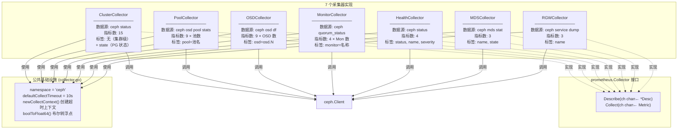
```mermaid
graph TB
    subgraph "prometheus.Collector 接口"
        IFACE["Describe(ch chan← *Desc)<br/>Collect(ch chan← Metric)"]
    end

    subgraph "7 个采集器实现"
        C1["ClusterCollector<br/>──────────────<br/>数据源: ceph status<br/>指标数: 15<br/>标签: 无（集群级）<br/>+ state（PG 状态）"]

        C2["PoolCollector<br/>──────────────<br/>数据源: ceph osd pool stats<br/>指标数: 9 × 池数<br/>标签: pool=池名"]

        C3["OSDCollector<br/>──────────────<br/>数据源: ceph osd df<br/>指标数: 9 × OSD 数<br/>标签: osd=osd.N"]

        C4["MonitorCollector<br/>──────────────<br/>数据源: ceph quorum_status<br/>指标数: 4 × Mon 数<br/>标签: monitor=名称"]

        C5["HealthCollector<br/>──────────────<br/>数据源: ceph status<br/>指标数: 4<br/>标签: status, name, severity"]

        C6["MDSCollector<br/>──────────────<br/>数据源: ceph mds stat<br/>指标数: 3<br/>标签: name, state"]

        C7["RGWCollector<br/>──────────────<br/>数据源: ceph service dump<br/>指标数: 3<br/>标签: name"]
    end

    subgraph "公共基础设施 (collector.go)"
        BASE["namespace = 'ceph'<br/>defaultCollectTimeout = 10s<br/>newCollectContext() 创建超时上下文<br/>boolToFloat64() 布尔转浮点"]
    end

    C1 & C2 & C3 & C4 & C5 & C6 & C7 -.->|"实现"| IFACE
    C1 & C2 & C3 & C4 & C5 & C6 & C7 -->|"使用"| BASE
    C1 & C2 & C3 & C4 & C5 & C6 & C7 -->|"调用"| CLIENT["ceph.Client"]
```

**每个采集器的工作模式完全相同：**

```
Prometheus 调用 Collect()
    → 创建 10 秒超时上下文
    → 调用 ceph.Client 的 GetXxxStats() 方法
    → 获取 JSON 数据并解析为 Go 结构体
    → 遍历数据，为每条记录创建 prometheus.Metric
    → 通过 channel 发送给 Prometheus
```

### 4.3 HTTP 服务器模块架构

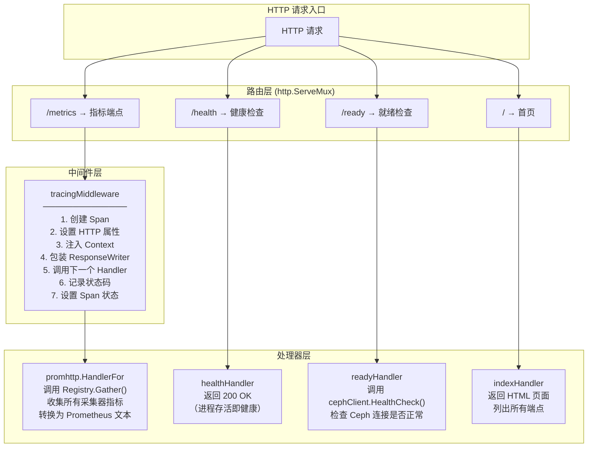
```mermaid
graph TB
    subgraph "HTTP 请求入口"
        REQ["HTTP 请求"]
    end

    subgraph "路由层 (http.ServeMux)"
        R1["/metrics → 指标端点"]
        R2["/health → 健康检查"]
        R3["/ready → 就绪检查"]
        R4["/ → 首页"]
    end

    subgraph "中间件层"
        MW["tracingMiddleware<br/>──────────────<br/>1. 创建 Span<br/>2. 设置 HTTP 属性<br/>3. 注入 Context<br/>4. 包装 ResponseWriter<br/>5. 调用下一个 Handler<br/>6. 记录状态码<br/>7. 设置 Span 状态"]
    end

    subgraph "处理器层"
        H1["promhttp.HandlerFor<br/>调用 Registry.Gather()<br/>收集所有采集器指标<br/>转换为 Prometheus 文本"]
        H2["healthHandler<br/>返回 200 OK<br/>（进程存活即健康）"]
        H3["readyHandler<br/>调用 cephClient.HealthCheck()<br/>检查 Ceph 连接是否正常"]
        H4["indexHandler<br/>返回 HTML 页面<br/>列出所有端点"]
    end

    REQ --> R1 & R2 & R3 & R4
    R1 --> MW --> H1
    R2 --> H2
    R3 --> H3
    R4 --> H4
```

**设计要点：**
- `/metrics` 经过追踪中间件，其他端点直接处理
- `/health` 只检查进程存活（Kubernetes liveness probe）
- `/ready` 检查 Ceph 连接（Kubernetes readiness probe）
- 支持 TLS/HTTPS、可配置读写超时

### 4.4 配置系统架构

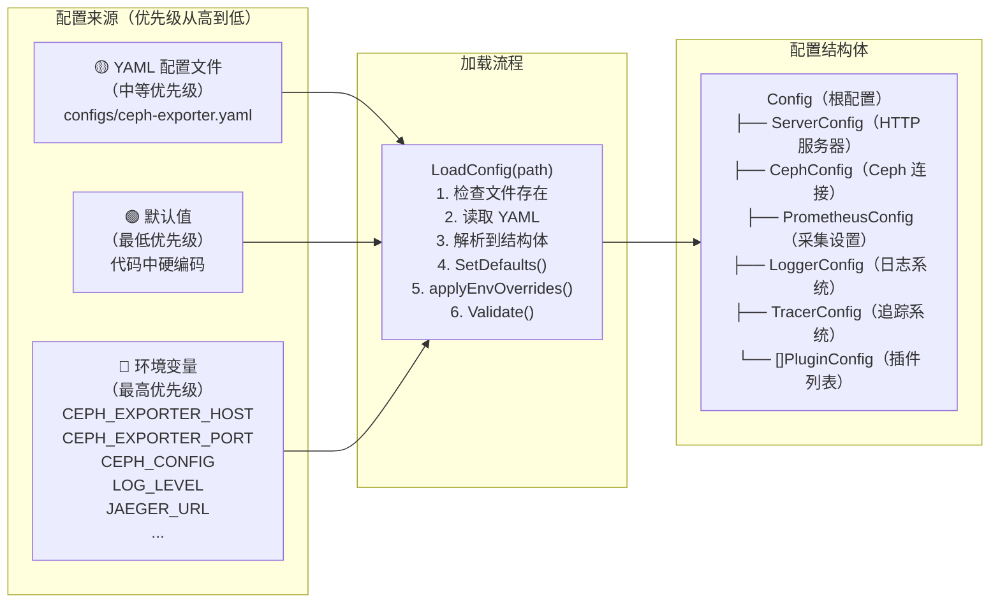
```mermaid
graph LR
    subgraph "配置来源（优先级从高到低）"
        ENV["🔴 环境变量<br/>（最高优先级）<br/>CEPH_EXPORTER_HOST<br/>CEPH_EXPORTER_PORT<br/>CEPH_CONFIG<br/>LOG_LEVEL<br/>JAEGER_URL<br/>..."]
        YAML["🟡 YAML 配置文件<br/>（中等优先级）<br/>configs/ceph-exporter.yaml"]
        DEFAULT["🟢 默认值<br/>（最低优先级）<br/>代码中硬编码"]
    end

    subgraph "配置结构体"
        CFG["Config（根配置）<br/>├── ServerConfig（HTTP 服务器）<br/>├── CephConfig（Ceph 连接）<br/>├── PrometheusConfig（采集设置）<br/>├── LoggerConfig（日志系统）<br/>├── TracerConfig（追踪系统）<br/>└── []PluginConfig（插件列表）"]
    end

    subgraph "加载流程"
        LOAD["LoadConfig(path)<br/>1. 检查文件存在<br/>2. 读取 YAML<br/>3. 解析到结构体<br/>4. SetDefaults()<br/>5. applyEnvOverrides()<br/>6. Validate()"]
    end

    YAML --> LOAD
    DEFAULT --> LOAD
    ENV --> LOAD
    LOAD --> CFG
```

### 4.5 日志系统架构

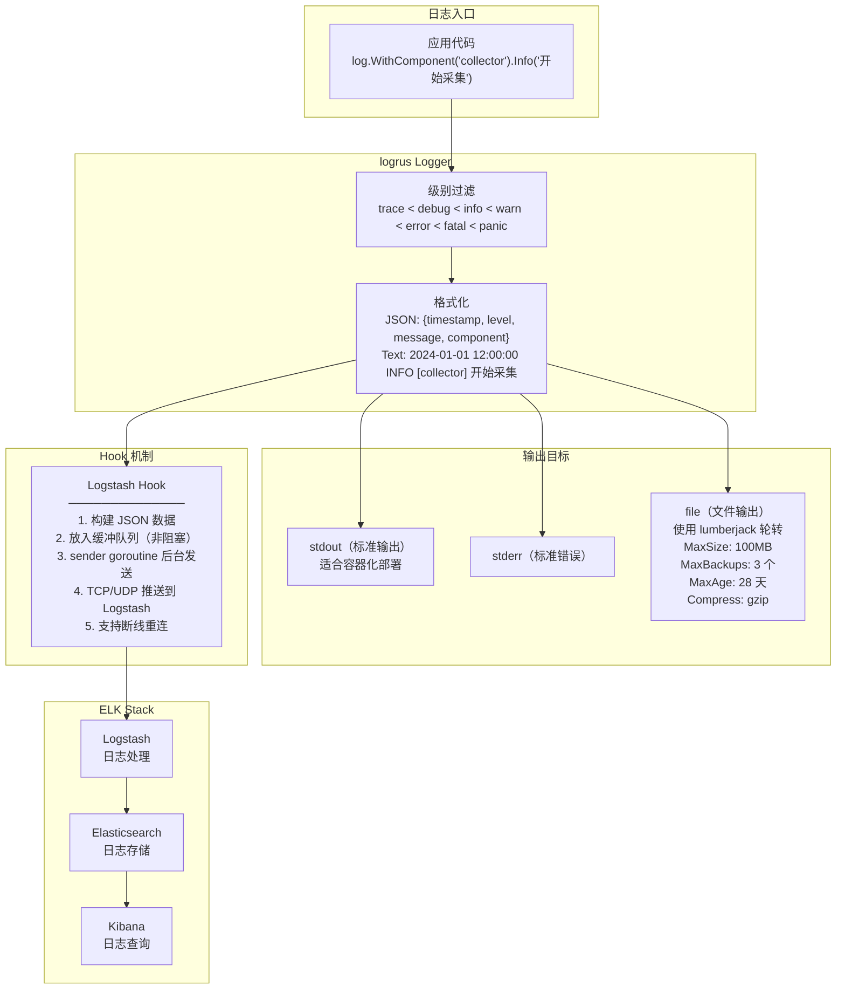
```mermaid
graph TB
    subgraph "日志入口"
        CODE["应用代码<br/>log.WithComponent('collector').Info('开始采集')"]
    end

    subgraph "logrus Logger"
        LEVEL["级别过滤<br/>trace < debug < info < warn < error < fatal < panic"]
        FORMAT["格式化<br/>JSON: {timestamp, level, message, component}<br/>Text: 2024-01-01 12:00:00 INFO [collector] 开始采集"]
    end

    subgraph "输出目标"
        STDOUT["stdout（标准输出）<br/>适合容器化部署"]
        STDERR["stderr（标准错误）"]
        FILE["file（文件输出）<br/>使用 lumberjack 轮转<br/>MaxSize: 100MB<br/>MaxBackups: 3 个<br/>MaxAge: 28 天<br/>Compress: gzip"]
    end

    subgraph "Hook 机制"
        HOOK["Logstash Hook<br/>──────────────<br/>1. 构建 JSON 数据<br/>2. 放入缓冲队列（非阻塞）<br/>3. sender goroutine 后台发送<br/>4. TCP/UDP 推送到 Logstash<br/>5. 支持断线重连"]
    end

    subgraph "ELK Stack"
        LS["Logstash<br/>日志处理"]
        ES["Elasticsearch<br/>日志存储"]
        KB["Kibana<br/>日志查询"]
    end

    CODE --> LEVEL --> FORMAT
    FORMAT --> STDOUT & STDERR & FILE
    FORMAT --> HOOK --> LS --> ES --> KB
```

### 4.6 追踪系统架构

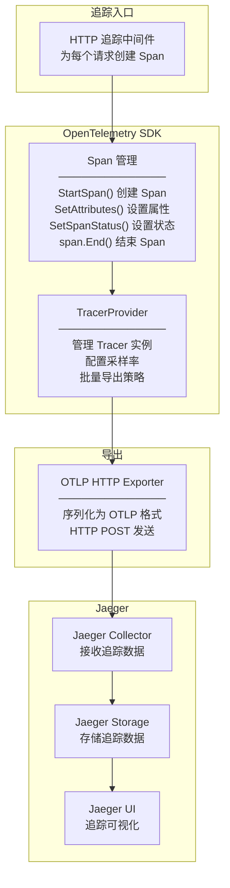
```mermaid
graph TB
    subgraph "追踪入口"
        MW["HTTP 追踪中间件<br/>为每个请求创建 Span"]
    end

    subgraph "OpenTelemetry SDK"
        SPAN["Span 管理<br/>──────────────<br/>StartSpan() 创建 Span<br/>SetAttributes() 设置属性<br/>SetSpanStatus() 设置状态<br/>span.End() 结束 Span"]

        TP["TracerProvider<br/>──────────────<br/>管理 Tracer 实例<br/>配置采样率<br/>批量导出策略"]
    end

    subgraph "导出"
        EXP["OTLP HTTP Exporter<br/>──────────────<br/>序列化为 OTLP 格式<br/>HTTP POST 发送"]
    end

    subgraph "Jaeger"
        JC["Jaeger Collector<br/>接收追踪数据"]
        JS["Jaeger Storage<br/>存储追踪数据"]
        JU["Jaeger UI<br/>追踪可视化"]
    end

    MW --> SPAN --> TP --> EXP --> JC --> JS --> JU
```

### 4.7 插件系统架构

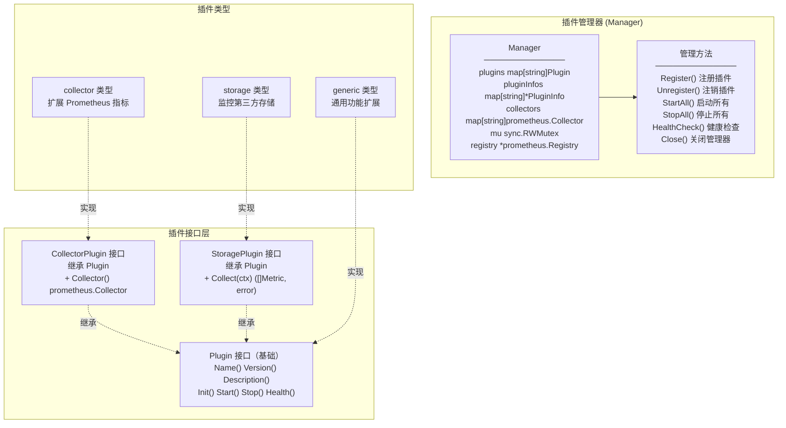
```mermaid
graph TB
    subgraph "插件接口层"
        PI["Plugin 接口（基础）<br/>Name() Version() Description()<br/>Init() Start() Stop() Health()"]
        CPI["CollectorPlugin 接口<br/>继承 Plugin<br/>+ Collector() prometheus.Collector"]
        SPI["StoragePlugin 接口<br/>继承 Plugin<br/>+ Collect(ctx) ([]Metric, error)"]
    end

    subgraph "插件管理器 (Manager)"
        MGR["Manager<br/>──────────────<br/>plugins map[string]Plugin<br/>pluginInfos map[string]*PluginInfo<br/>collectors map[string]prometheus.Collector<br/>mu sync.RWMutex<br/>registry *prometheus.Registry"]

        METHODS["管理方法<br/>──────────────<br/>Register() 注册插件<br/>Unregister() 注销插件<br/>StartAll() 启动所有<br/>StopAll() 停止所有<br/>HealthCheck() 健康检查<br/>Close() 关闭管理器"]
    end

    subgraph "插件类型"
        T1["collector 类型<br/>扩展 Prometheus 指标"]
        T2["storage 类型<br/>监控第三方存储"]
        T3["generic 类型<br/>通用功能扩展"]
    end

    CPI & SPI -.->|"继承"| PI
    MGR --> METHODS
    T1 -.->|"实现"| CPI
    T2 -.->|"实现"| SPI
    T3 -.->|"实现"| PI
```

---

## 5. 整体流程图

### 5.1 应用启动流程

<!-- 注释：这是程序从启动到运行的完整流程 -->
<!-- main.go 按顺序初始化所有组件，最后阻塞等待退出信号 -->

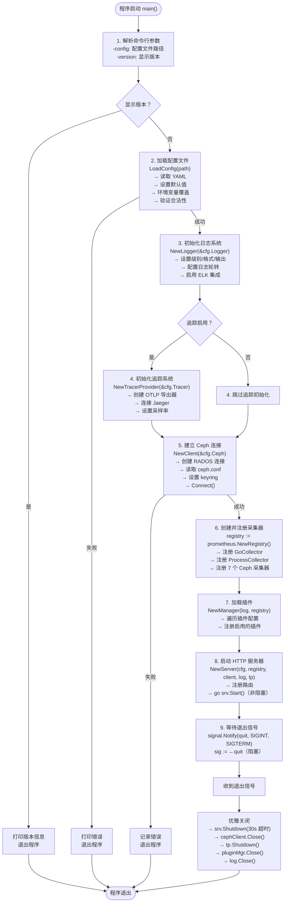
```mermaid
flowchart TD
    START(["程序启动 main()"])

    A["1. 解析命令行参数<br/>-config: 配置文件路径<br/>-version: 显示版本"]
    B{"显示版本？"}
    B_YES["打印版本信息<br/>退出程序"]

    C["2. 加载配置文件<br/>LoadConfig(path)<br/>→ 读取 YAML<br/>→ 设置默认值<br/>→ 环境变量覆盖<br/>→ 验证合法性"]
    C_ERR["打印错误<br/>退出程序"]

    D["3. 初始化日志系统<br/>NewLogger(&cfg.Logger)<br/>→ 设置级别/格式/输出<br/>→ 配置日志轮转<br/>→ 启用 ELK 集成"]

    E{"追踪启用？"}
    E_YES["4. 初始化追踪系统<br/>NewTracerProvider(&cfg.Tracer)<br/>→ 创建 OTLP 导出器<br/>→ 连接 Jaeger<br/>→ 设置采样率"]
    E_NO["4. 跳过追踪初始化"]

    F["5. 建立 Ceph 连接<br/>NewClient(&cfg.Ceph)<br/>→ 创建 RADOS 连接<br/>→ 读取 ceph.conf<br/>→ 设置 keyring<br/>→ Connect()"]
    F_ERR["记录错误<br/>退出程序"]

    G["6. 创建并注册采集器<br/>registry := prometheus.NewRegistry()<br/>→ 注册 GoCollector<br/>→ 注册 ProcessCollector<br/>→ 注册 7 个 Ceph 采集器"]

    H["7. 加载插件<br/>NewManager(log, registry)<br/>→ 遍历插件配置<br/>→ 注册启用的插件"]

    I["8. 启动 HTTP 服务器<br/>NewServer(cfg, registry, client, log, tp)<br/>→ 注册路由<br/>→ go srv.Start()（非阻塞）"]

    J["9. 等待退出信号<br/>signal.Notify(quit, SIGINT, SIGTERM)<br/>sig := ←quit（阻塞）"]

    K["收到退出信号"]

    L["优雅关闭<br/>→ srv.Shutdown(30s 超时)<br/>→ cephClient.Close()<br/>→ tp.Shutdown()<br/>→ pluginMgr.Close()<br/>→ log.Close()"]

    END(["程序退出"])

    START --> A --> B
    B -->|"是"| B_YES --> END
    B -->|"否"| C
    C -->|"失败"| C_ERR --> END
    C -->|"成功"| D --> E
    E -->|"是"| E_YES --> F
    E -->|"否"| E_NO --> F
    F -->|"失败"| F_ERR --> END
    F -->|"成功"| G --> H --> I --> J --> K --> L --> END
```

### 5.2 指标采集整体流程

<!-- 注释：这是 Prometheus 每次抓取指标时的完整数据流 -->

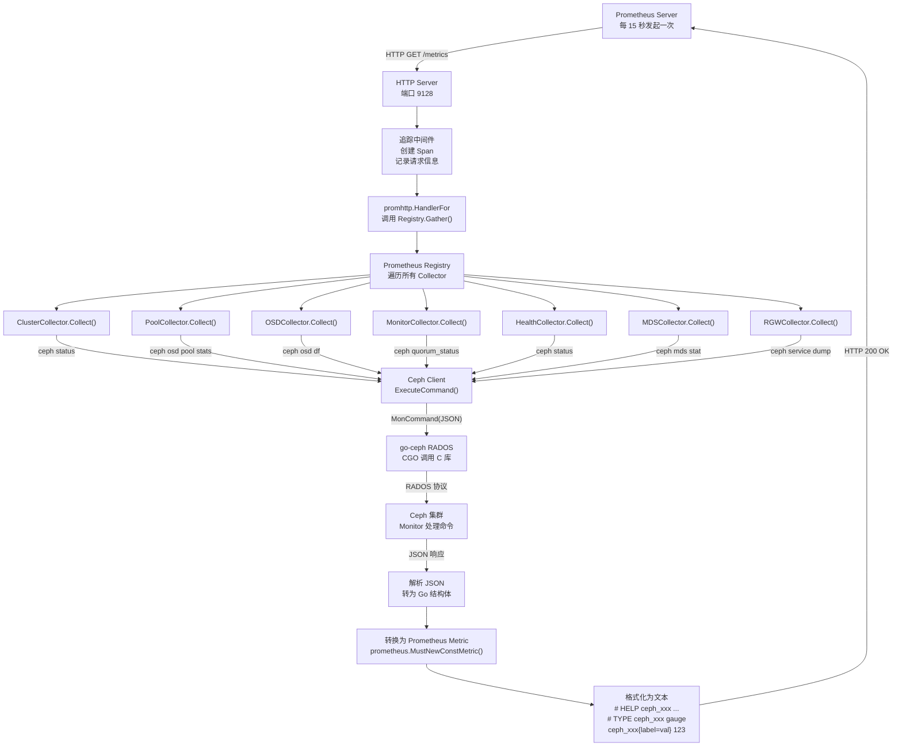
```mermaid
flowchart TD
    P["Prometheus Server<br/>每 15 秒发起一次"]
    -->|"HTTP GET /metrics"| S["HTTP Server<br/>端口 9128"]
    --> MW["追踪中间件<br/>创建 Span<br/>记录请求信息"]
    --> PH["promhttp.HandlerFor<br/>调用 Registry.Gather()"]
    --> REG["Prometheus Registry<br/>遍历所有 Collector"]

    REG --> C1["ClusterCollector.Collect()"]
    REG --> C2["PoolCollector.Collect()"]
    REG --> C3["OSDCollector.Collect()"]
    REG --> C4["MonitorCollector.Collect()"]
    REG --> C5["HealthCollector.Collect()"]
    REG --> C6["MDSCollector.Collect()"]
    REG --> C7["RGWCollector.Collect()"]

    C1 -->|"ceph status"| CLIENT["Ceph Client<br/>ExecuteCommand()"]
    C2 -->|"ceph osd pool stats"| CLIENT
    C3 -->|"ceph osd df"| CLIENT
    C4 -->|"ceph quorum_status"| CLIENT
    C5 -->|"ceph status"| CLIENT
    C6 -->|"ceph mds stat"| CLIENT
    C7 -->|"ceph service dump"| CLIENT

    CLIENT -->|"MonCommand(JSON)"| RADOS["go-ceph RADOS<br/>CGO 调用 C 库"]
    -->|"RADOS 协议"| CEPH["Ceph 集群<br/>Monitor 处理命令"]
    -->|"JSON 响应"| PARSE["解析 JSON<br/>转为 Go 结构体"]
    --> CONVERT["转换为 Prometheus Metric<br/>prometheus.MustNewConstMetric()"]
    --> FORMAT["格式化为文本<br/># HELP ceph_xxx ...<br/># TYPE ceph_xxx gauge<br/>ceph_xxx{label=val} 123"]
    -->|"HTTP 200 OK"| P
```

---

## 6. 局部流程图

### 6.1 配置加载流程

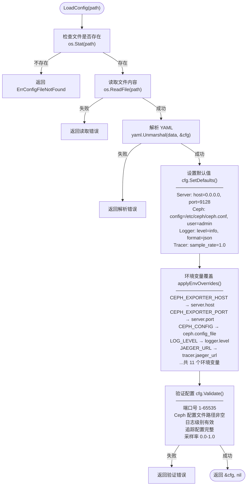
```mermaid
flowchart TD
    START(["LoadConfig(path)"])

    A["检查文件是否存在<br/>os.Stat(path)"]
    A_ERR["返回 ErrConfigFileNotFound"]

    B["读取文件内容<br/>os.ReadFile(path)"]
    B_ERR["返回读取错误"]

    C["解析 YAML<br/>yaml.Unmarshal(data, &cfg)"]
    C_ERR["返回解析错误"]

    D["设置默认值 cfg.SetDefaults()<br/>──────────────<br/>Server: host=0.0.0.0, port=9128<br/>Ceph: config=/etc/ceph/ceph.conf, user=admin<br/>Logger: level=info, format=json<br/>Tracer: sample_rate=1.0"]

    E["环境变量覆盖 applyEnvOverrides()<br/>──────────────<br/>CEPH_EXPORTER_HOST → server.host<br/>CEPH_EXPORTER_PORT → server.port<br/>CEPH_CONFIG → ceph.config_file<br/>LOG_LEVEL → logger.level<br/>JAEGER_URL → tracer.jaeger_url<br/>...共 11 个环境变量"]

    F["验证配置 cfg.Validate()<br/>──────────────<br/>端口号 1-65535<br/>Ceph 配置文件路径非空<br/>日志级别有效<br/>追踪配置完整<br/>采样率 0.0-1.0"]
    F_ERR["返回验证错误"]

    OK(["返回 &cfg, nil"])

    START --> A
    A -->|"不存在"| A_ERR
    A -->|"存在"| B
    B -->|"失败"| B_ERR
    B -->|"成功"| C
    C -->|"失败"| C_ERR
    C -->|"成功"| D --> E --> F
    F -->|"失败"| F_ERR
    F -->|"成功"| OK
```

### 6.2 Ceph 命令执行流程

<!-- 注释：这是 ExecuteCommand 的详细流程 -->
<!-- 核心设计：goroutine + channel + select 实现超时控制 -->

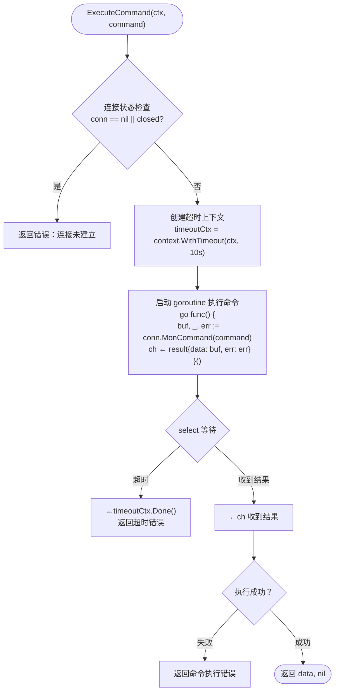
```mermaid
flowchart TD
    START(["ExecuteCommand(ctx, command)"])

    A{"连接状态检查<br/>conn == nil || closed?"}
    A_ERR["返回错误：连接未建立"]

    B["创建超时上下文<br/>timeoutCtx = context.WithTimeout(ctx, 10s)"]

    C["启动 goroutine 执行命令<br/>go func() {<br/>  buf, _, err := conn.MonCommand(command)<br/>  ch ← result{data: buf, err: err}<br/>}()"]

    D{"select 等待"}
    D_TIMEOUT["←timeoutCtx.Done()<br/>返回超时错误"]
    D_RESULT["←ch 收到结果"]

    E{"执行成功？"}
    E_ERR["返回命令执行错误"]
    E_OK(["返回 data, nil"])

    START --> A
    A -->|"是"| A_ERR
    A -->|"否"| B --> C --> D
    D -->|"超时"| D_TIMEOUT
    D -->|"收到结果"| D_RESULT --> E
    E -->|"失败"| E_ERR
    E -->|"成功"| E_OK
```

### 6.3 OSD 指标采集流程（典型采集器示例）

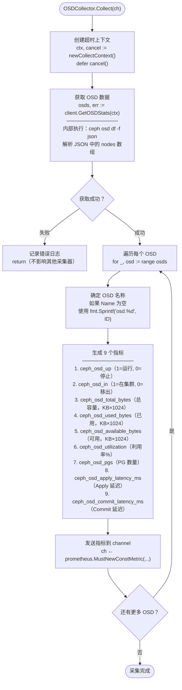
```mermaid
flowchart TD
    START(["OSDCollector.Collect(ch)"])

    A["创建超时上下文<br/>ctx, cancel := newCollectContext()<br/>defer cancel()"]

    B["获取 OSD 数据<br/>osds, err := client.GetOSDStats(ctx)<br/>──────────────<br/>内部执行：ceph osd df -f json<br/>解析 JSON 中的 nodes 数组"]

    C{"获取成功？"}
    C_ERR["记录错误日志<br/>return（不影响其他采集器）"]

    D["遍历每个 OSD<br/>for _, osd := range osds"]

    E["确定 OSD 名称<br/>如果 Name 为空<br/>使用 fmt.Sprintf('osd.%d', ID)"]

    F["生成 9 个指标<br/>──────────────<br/>1. ceph_osd_up（1=运行, 0=停止）<br/>2. ceph_osd_in（1=在集群, 0=移出）<br/>3. ceph_osd_total_bytes（总容量，KB×1024）<br/>4. ceph_osd_used_bytes（已用，KB×1024）<br/>5. ceph_osd_available_bytes（可用，KB×1024）<br/>6. ceph_osd_utilization（利用率%）<br/>7. ceph_osd_pgs（PG 数量）<br/>8. ceph_osd_apply_latency_ms（Apply 延迟）<br/>9. ceph_osd_commit_latency_ms（Commit 延迟）"]

    G["发送指标到 channel<br/>ch ← prometheus.MustNewConstMetric(...)"]

    H{"还有更多 OSD？"}

    END(["采集完成"])

    START --> A --> B --> C
    C -->|"失败"| C_ERR
    C -->|"成功"| D --> E --> F --> G --> H
    H -->|"是"| D
    H -->|"否"| END
```

### 6.4 HTTP 请求处理流程（/metrics）

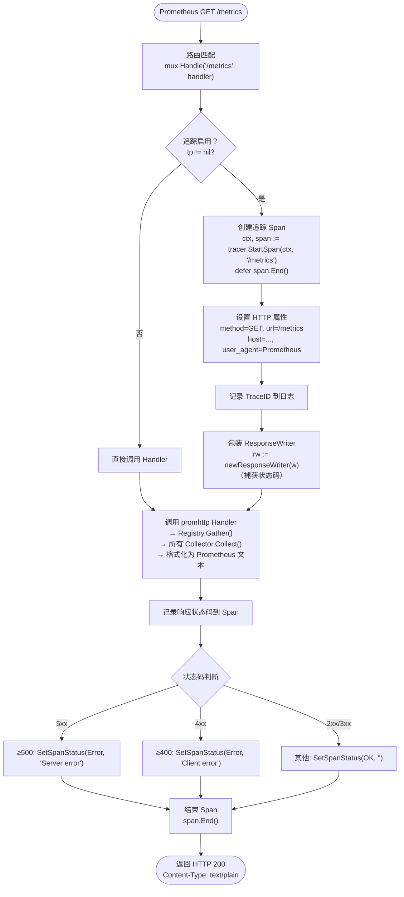
```mermaid
flowchart TD
    REQ(["Prometheus GET /metrics"])

    A["路由匹配<br/>mux.Handle('/metrics', handler)"]

    B{"追踪启用？<br/>tp != nil?"}
    B_NO["直接调用 Handler"]

    C["创建追踪 Span<br/>ctx, span := tracer.StartSpan(ctx, '/metrics')<br/>defer span.End()"]

    D["设置 HTTP 属性<br/>method=GET, url=/metrics<br/>host=..., user_agent=Prometheus"]

    E["记录 TraceID 到日志"]

    F["包装 ResponseWriter<br/>rw := newResponseWriter(w)<br/>（捕获状态码）"]

    G["调用 promhttp Handler<br/>→ Registry.Gather()<br/>→ 所有 Collector.Collect()<br/>→ 格式化为 Prometheus 文本"]

    H["记录响应状态码到 Span"]

    I{"状态码判断"}
    I_5XX["≥500: SetSpanStatus(Error, 'Server error')"]
    I_4XX["≥400: SetSpanStatus(Error, 'Client error')"]
    I_OK["其他: SetSpanStatus(OK, '')"]

    J["结束 Span<br/>span.End()"]

    RESP(["返回 HTTP 200<br/>Content-Type: text/plain"])

    REQ --> A --> B
    B -->|"否"| B_NO --> G
    B -->|"是"| C --> D --> E --> F --> G --> H --> I
    I -->|"5xx"| I_5XX --> J
    I -->|"4xx"| I_4XX --> J
    I -->|"2xx/3xx"| I_OK --> J
    J --> RESP
```

### 6.5 优雅关闭流程

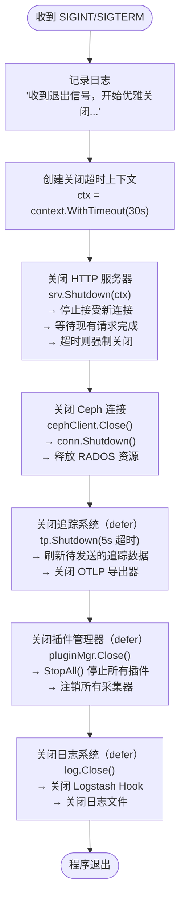
```mermaid
flowchart TD
    SIG(["收到 SIGINT/SIGTERM"])

    A["记录日志<br/>'收到退出信号，开始优雅关闭...'"]

    B["创建关闭超时上下文<br/>ctx = context.WithTimeout(30s)"]

    C["关闭 HTTP 服务器<br/>srv.Shutdown(ctx)<br/>→ 停止接受新连接<br/>→ 等待现有请求完成<br/>→ 超时则强制关闭"]

    D["关闭 Ceph 连接<br/>cephClient.Close()<br/>→ conn.Shutdown()<br/>→ 释放 RADOS 资源"]

    E["关闭追踪系统（defer）<br/>tp.Shutdown(5s 超时)<br/>→ 刷新待发送的追踪数据<br/>→ 关闭 OTLP 导出器"]

    F["关闭插件管理器（defer）<br/>pluginMgr.Close()<br/>→ StopAll() 停止所有插件<br/>→ 注销所有采集器"]

    G["关闭日志系统（defer）<br/>log.Close()<br/>→ 关闭 Logstash Hook<br/>→ 关闭日志文件"]

    END(["程序退出"])

    SIG --> A --> B --> C --> D
    D --> E --> F --> G --> END
```

### 6.6 插件加载流程

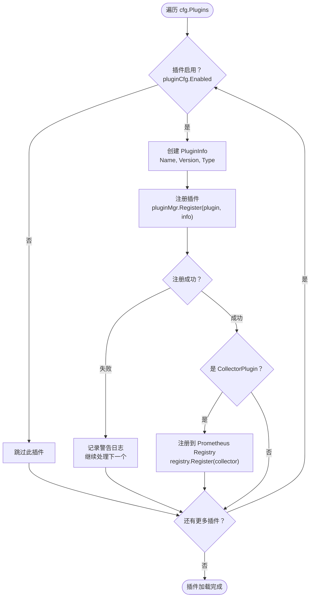
```mermaid
flowchart TD
    START(["遍历 cfg.Plugins"])

    A{"插件启用？<br/>pluginCfg.Enabled"}
    A_NO["跳过此插件"]

    B["创建 PluginInfo<br/>Name, Version, Type"]

    C["注册插件<br/>pluginMgr.Register(plugin, info)"]

    D{"注册成功？"}
    D_ERR["记录警告日志<br/>继续处理下一个"]

    E{"是 CollectorPlugin？"}
    E_YES["注册到 Prometheus Registry<br/>registry.Register(collector)"]

    F{"还有更多插件？"}

    END(["插件加载完成"])

    START --> A
    A -->|"否"| A_NO --> F
    A -->|"是"| B --> C --> D
    D -->|"失败"| D_ERR --> F
    D -->|"成功"| E
    E -->|"是"| E_YES --> F
    E -->|"否"| F
    F -->|"是"| A
    F -->|"否"| END
```

---

## 7. 整体时序图

### 7.1 Prometheus 抓取指标完整时序

<!-- 注释：这是最核心的时序图，展示了从 Prometheus 发起请求到收到响应的完整过程 -->

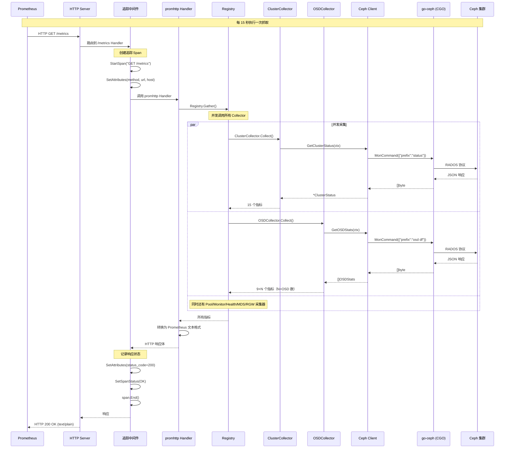
```mermaid
sequenceDiagram
    participant P as Prometheus
    participant S as HTTP Server
    participant MW as 追踪中间件
    participant PH as promhttp Handler
    participant R as Registry
    participant CC as ClusterCollector
    participant OC as OSDCollector
    participant CL as Ceph Client
    participant RADOS as go-ceph (CGO)
    participant CEPH as Ceph 集群

    Note over P,CEPH: 每 15 秒执行一次抓取

    P->>S: HTTP GET /metrics
    S->>MW: 路由到 /metrics Handler

    Note over MW: 创建追踪 Span
    MW->>MW: StartSpan("GET /metrics")
    MW->>MW: SetAttributes(method, url, host)

    MW->>PH: 调用 promhttp Handler
    PH->>R: Registry.Gather()

    Note over R: 并发调用所有 Collector

    par 并发采集
        R->>CC: ClusterCollector.Collect()
        CC->>CL: GetClusterStatus(ctx)
        CL->>RADOS: MonCommand({"prefix":"status"})
        RADOS->>CEPH: RADOS 协议
        CEPH-->>RADOS: JSON 响应
        RADOS-->>CL: []byte
        CL-->>CC: *ClusterStatus
        CC-->>R: 15 个指标
    and
        R->>OC: OSDCollector.Collect()
        OC->>CL: GetOSDStats(ctx)
        CL->>RADOS: MonCommand({"prefix":"osd df"})
        RADOS->>CEPH: RADOS 协议
        CEPH-->>RADOS: JSON 响应
        RADOS-->>CL: []byte
        CL-->>OC: []OSDStats
        OC-->>R: 9×N 个指标（N=OSD 数）
    and
        Note over R: 同时还有 Pool/Monitor/Health/MDS/RGW 采集器
    end

    R-->>PH: 所有指标
    PH->>PH: 转换为 Prometheus 文本格式
    PH-->>MW: HTTP 响应体

    Note over MW: 记录响应状态
    MW->>MW: SetAttributes(status_code=200)
    MW->>MW: SetSpanStatus(OK)
    MW->>MW: span.End()

    MW-->>S: 响应
    S-->>P: HTTP 200 OK (text/plain)
```

---

## 8. 局部时序图

### 8.1 应用启动时序

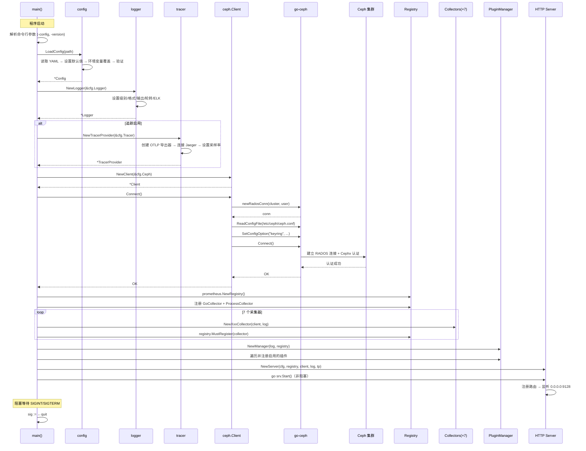
```mermaid
sequenceDiagram
    participant M as main()
    participant CFG as config
    participant LOG as logger
    participant TR as tracer
    participant CC as ceph.Client
    participant RADOS as go-ceph
    participant CEPH as Ceph 集群
    participant REG as Registry
    participant COL as Collectors(×7)
    participant PLG as PluginManager
    participant SRV as HTTP Server

    Note over M: 程序启动

    M->>M: 解析命令行参数 (-config, -version)

    M->>CFG: LoadConfig(path)
    CFG->>CFG: 读取 YAML → 设置默认值 → 环境变量覆盖 → 验证
    CFG-->>M: *Config

    M->>LOG: NewLogger(&cfg.Logger)
    LOG->>LOG: 设置级别/格式/输出/轮转/ELK
    LOG-->>M: *Logger

    alt 追踪启用
        M->>TR: NewTracerProvider(&cfg.Tracer)
        TR->>TR: 创建 OTLP 导出器 → 连接 Jaeger → 设置采样率
        TR-->>M: *TracerProvider
    end

    M->>CC: NewClient(&cfg.Ceph)
    CC-->>M: *Client

    M->>CC: Connect()
    CC->>RADOS: newRadosConn(cluster, user)
    RADOS-->>CC: conn
    CC->>RADOS: ReadConfigFile(/etc/ceph/ceph.conf)
    CC->>RADOS: SetConfigOption("keyring", ...)
    CC->>RADOS: Connect()
    RADOS->>CEPH: 建立 RADOS 连接 + Cephx 认证
    CEPH-->>RADOS: 认证成功
    RADOS-->>CC: OK
    CC-->>M: OK

    M->>REG: prometheus.NewRegistry()
    M->>REG: 注册 GoCollector + ProcessCollector

    loop 7 个采集器
        M->>COL: NewXxxCollector(client, log)
        M->>REG: registry.MustRegister(collector)
    end

    M->>PLG: NewManager(log, registry)
    M->>PLG: 遍历并注册启用的插件

    M->>SRV: NewServer(cfg, registry, client, log, tp)
    M->>SRV: go srv.Start()（非阻塞）
    SRV->>SRV: 注册路由 → 监听 0.0.0.0:9128

    Note over M: 阻塞等待 SIGINT/SIGTERM
    M->>M: sig := ←quit
```

### 8.2 Ceph 连接建立时序

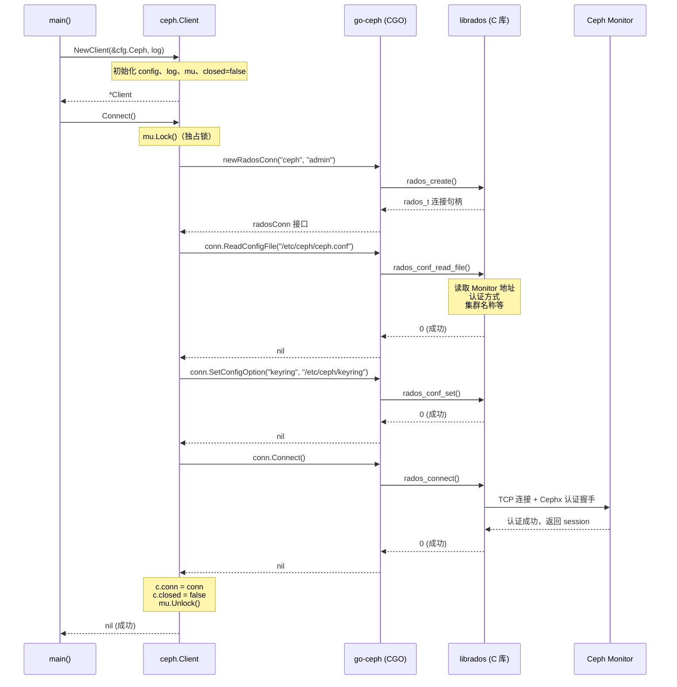
```mermaid
sequenceDiagram
    participant M as main()
    participant C as ceph.Client
    participant R as go-ceph (CGO)
    participant LIB as librados (C 库)
    participant MON as Ceph Monitor

    M->>C: NewClient(&cfg.Ceph, log)
    Note over C: 初始化 config、log、mu、closed=false
    C-->>M: *Client

    M->>C: Connect()
    Note over C: mu.Lock()（独占锁）

    C->>R: newRadosConn("ceph", "admin")
    R->>LIB: rados_create()
    LIB-->>R: rados_t 连接句柄
    R-->>C: radosConn 接口

    C->>R: conn.ReadConfigFile("/etc/ceph/ceph.conf")
    R->>LIB: rados_conf_read_file()
    Note over LIB: 读取 Monitor 地址<br/>认证方式<br/>集群名称等
    LIB-->>R: 0 (成功)
    R-->>C: nil

    C->>R: conn.SetConfigOption("keyring", "/etc/ceph/keyring")
    R->>LIB: rados_conf_set()
    LIB-->>R: 0 (成功)
    R-->>C: nil

    C->>R: conn.Connect()
    R->>LIB: rados_connect()
    LIB->>MON: TCP 连接 + Cephx 认证握手
    MON-->>LIB: 认证成功，返回 session
    LIB-->>R: 0 (成功)
    R-->>C: nil

    Note over C: c.conn = conn<br/>c.closed = false<br/>mu.Unlock()
    C-->>M: nil (成功)
```

### 8.3 健康检查时序

```mermaid
sequenceDiagram
    participant K as Kubernetes
    participant S as HTTP Server
    participant C as ceph.Client
    participant CEPH as Ceph 集群

    Note over K,CEPH: Liveness Probe（/health）

    K->>S: GET /health
    S->>S: healthHandler()
    Note over S: 只检查进程存活<br/>不检查外部依赖
    S-->>K: 200 OK "OK"

    Note over K,CEPH: Readiness Probe（/ready）

    K->>S: GET /ready
    S->>S: readyHandler()

    alt cephClient == nil
        S-->>K: 200 OK "Ready"
    else cephClient != nil
        S->>C: HealthCheck()
        C->>C: GetClusterStatus(5s 超时)
        C->>CEPH: ceph status -f json
        alt 连接正常
            CEPH-->>C: JSON 响应
            C-->>S: nil
            S-->>K: 200 OK "Ready"
        else 连接异常
            CEPH-->>C: 超时/错误
            C-->>S: error
            S-->>K: 503 Service Unavailable "Not Ready"
        end
    end
```

### 8.4 优雅关闭时序

```mermaid
sequenceDiagram
    participant OS as 操作系统
    participant M as main()
    participant SRV as HTTP Server
    participant C as ceph.Client
    participant TR as TracerProvider
    participant PLG as PluginManager
    participant LOG as Logger

    OS->>M: SIGINT (Ctrl+C) 或 SIGTERM (kill)
    Note over M: sig := ←quit

    M->>M: 记录日志 "收到退出信号"
    M->>M: ctx = context.WithTimeout(30s)

    M->>SRV: Shutdown(ctx)
    Note over SRV: 停止接受新连接<br/>等待现有请求完成<br/>最多等 30 秒
    SRV-->>M: nil

    Note over M: defer 按 LIFO 顺序执行

    M->>C: Close()（defer）
    Note over C: conn.Shutdown()<br/>释放 RADOS 资源
    C-->>M: void

    M->>TR: Shutdown(5s 超时)（defer）
    Note over TR: 刷新待发送的追踪数据<br/>关闭 OTLP 导出器
    TR-->>M: nil

    M->>PLG: Close()（defer）
    Note over PLG: StopAll() 停止所有插件<br/>注销所有采集器<br/>清空映射
    PLG-->>M: nil

    M->>LOG: Close()（defer）
    Note over LOG: 关闭 Logstash Hook<br/>关闭日志文件
    LOG-->>M: nil

    Note over M: 程序退出
```

---

## 9. 关键数据结构详解

### 9.1 配置结构体层级

```go
// Config 根配置（对应 YAML 文件的顶层）
type Config struct {
    Server     ServerConfig     // HTTP 服务器配置
    Ceph       CephConfig       // Ceph 集群连接配置
    Prometheus PrometheusConfig // Prometheus 采集配置
    Logger     LoggerConfig     // 日志系统配置
    Tracer     TracerConfig     // 追踪系统配置
    Plugins    []PluginConfig   // 插件配置列表
}

// ServerConfig HTTP 服务器配置
type ServerConfig struct {
    Host         string        // 监听地址，默认 "0.0.0.0"（所有网卡）
    Port         int           // 监听端口，默认 9128
    ReadTimeout  time.Duration // HTTP 读取超时，默认 30s
    WriteTimeout time.Duration // HTTP 写入超时，默认 30s
    TLSCertFile  string        // TLS 证书路径（留空不启用 HTTPS）
    TLSKeyFile   string        // TLS 密钥路径
}

// CephConfig Ceph 集群连接配置
type CephConfig struct {
    ConfigFile string        // Ceph 配置文件，默认 /etc/ceph/ceph.conf
    User       string        // 认证用户，默认 admin
    Keyring    string        // Keyring 文件路径
    Cluster    string        // 集群名称，默认 ceph
    Timeout    time.Duration // 命令超时，默认 10s
}

// LoggerConfig 日志配置
type LoggerConfig struct {
    Level            string // 级别: trace/debug/info/warn/error/fatal/panic
    Format           string // 格式: json（机器解析）/ text（人工阅读）
    Output           string // 输出: stdout / stderr / file
    FilePath         string // 日志文件路径（output=file 时）
    MaxSize          int    // 单文件最大 MB，默认 100
    MaxBackups       int    // 保留旧文件数，默认 3
    MaxAge           int    // 保留天数，默认 28
    Compress         bool   // 是否压缩旧文件
    EnableELK        bool   // 是否启用 ELK 集成
    LogstashURL      string // Logstash 地址
    LogstashProtocol string // tcp 或 udp，默认 tcp
    ServiceName      string // 服务名称标识
}

// TracerConfig 追踪配置
type TracerConfig struct {
    Enabled     bool    // 是否启用
    JaegerURL   string  // Jaeger Collector URL
    ServiceName string  // 服务名称
    SampleRate  float64 // 采样率 0.0-1.0（1.0=全量）
}
```

### 9.2 Ceph 数据结构

```go
// ClusterStatus 集群状态（对应 ceph status -f json）
type ClusterStatus struct {
    Health struct {
        Status string                    // HEALTH_OK / HEALTH_WARN / HEALTH_ERR
        Checks map[string]struct {       // 健康检查项（如 OSD_DOWN, PG_DEGRADED）
            Severity string              // 严重程度
            Summary  struct {
                Message string           // 描述信息
            }
        }
    }
    PGMap struct {
        NumPGs        int                // PG 总数
        NumPools      int                // 存储池总数
        BytesUsed     int64              // 已使用空间（字节）
        BytesAvail    int64              // 可用空间
        BytesTotal    int64              // 总空间
        ReadBytesSec  int64              // 读取速率（字节/秒）
        WriteBytesSec int64              // 写入速率
        ReadOpPerSec  int64              // 读 IOPS
        WriteOpPerSec int64              // 写 IOPS
        NumObjects    int64              // 对象总数
        PGsByState    []PGStateEntry     // 按状态分组的 PG
    }
    OSDMap struct {
        NumOSDs   int                    // OSD 总数
        NumUpOSDs int                    // Up 状态 OSD 数
        NumInOSDs int                    // In 状态 OSD 数
    }
    MonMap struct {
        NumMons int                      // Monitor 总数
    }
}

// OSDStats OSD 统计（对应 ceph osd df -f json 中的 nodes）
type OSDStats struct {
    ID              int     // OSD ID（如 0, 1, 2）
    Name            string  // OSD 名称（如 "osd.0"）
    Status          string  // "up" 或 "down"
    Reweight        float64 // 权重（1.0=in, 0.0=out）
    TotalBytes      int64   // 总容量（KB）← 注意单位！
    UsedBytes       int64   // 已用容量（KB）
    AvailBytes      int64   // 可用容量（KB）
    Utilization     float64 // 利用率（0-100%）
    PGs             int     // PG 数量
    ApplyLatencyMs  float64 // Apply 延迟（毫秒）
    CommitLatencyMs float64 // Commit 延迟（毫秒）
}
// Up() 方法：Status=="up" 返回 1，否则 0
// In() 方法：Reweight>0 返回 1，否则 0

// PoolStats 存储池统计（对应 ceph osd pool stats -f json）
type PoolStats struct {
    PoolName string  // 池名称（如 rbd, cephfs_data）
    PoolID   int     // 池 ID
    Stats    struct {
        Stored      int64   // 已存储数据量（字节）
        Objects     int64   // 对象数量
        MaxAvail    int64   // 最大可用空间
        BytesUsed   int64   // 已用空间
        PercentUsed float64 // 使用率
    }
    ClientIORate struct {
        ReadBytesSec  int64 // 读取速率
        WriteBytesSec int64 // 写入速率
        ReadOpPerSec  int64 // 读 IOPS
        WriteOpPerSec int64 // 写 IOPS
    }
}

// MonitorStats Monitor 统计（对应 ceph quorum_status -f json）
type MonitorStats struct {
    Name       string  // Monitor 名称
    Rank       int     // 排名
    Address    string  // 地址（IP:端口）
    StoreBytes int64   // 存储大小
    ClockSkew  float64 // 时钟偏差（秒）
    LatencyMs  float64 // 延迟（毫秒）
    InQuorum   bool    // 是否在仲裁中（代码计算，非 JSON 字段）
}
```

---

## 10. Prometheus 指标完整清单

### 10.1 集群指标（ClusterCollector）— 15 个

| 指标名 | 类型 | 标签 | 说明 |
|--------|------|------|------|
| `ceph_cluster_total_bytes` | Gauge | 无 | 集群总容量（字节） |
| `ceph_cluster_used_bytes` | Gauge | 无 | 集群已用容量 |
| `ceph_cluster_available_bytes` | Gauge | 无 | 集群可用容量 |
| `ceph_cluster_objects_total` | Gauge | 无 | 对象总数 |
| `ceph_cluster_read_bytes_sec` | Gauge | 无 | 读取吞吐量（字节/秒） |
| `ceph_cluster_write_bytes_sec` | Gauge | 无 | 写入吞吐量 |
| `ceph_cluster_read_ops_sec` | Gauge | 无 | 读 IOPS |
| `ceph_cluster_write_ops_sec` | Gauge | 无 | 写 IOPS |
| `ceph_cluster_pgs_total` | Gauge | 无 | PG 总数 |
| `ceph_cluster_pgs_by_state` | Gauge | state | 各状态 PG 数（如 active+clean） |
| `ceph_cluster_pools_total` | Gauge | 无 | 存储池总数 |
| `ceph_cluster_osds_total` | Gauge | 无 | OSD 总数 |
| `ceph_cluster_osds_up` | Gauge | 无 | Up 状态 OSD 数 |
| `ceph_cluster_osds_in` | Gauge | 无 | In 状态 OSD 数 |
| `ceph_cluster_mons_total` | Gauge | 无 | Monitor 总数 |

### 10.2 存储池指标（PoolCollector）— 9 个/池

| 指标名 | 类型 | 标签 | 说明 |
|--------|------|------|------|
| `ceph_pool_stored_bytes` | Gauge | pool | 已存储数据量 |
| `ceph_pool_max_available_bytes` | Gauge | pool | 最大可用容量 |
| `ceph_pool_used_bytes` | Gauge | pool | 已用容量 |
| `ceph_pool_percent_used` | Gauge | pool | 使用率（0.0-1.0） |
| `ceph_pool_objects_total` | Gauge | pool | 对象数量 |
| `ceph_pool_read_bytes_sec` | Gauge | pool | 读取吞吐量 |
| `ceph_pool_write_bytes_sec` | Gauge | pool | 写入吞吐量 |
| `ceph_pool_read_ops_sec` | Gauge | pool | 读 IOPS |
| `ceph_pool_write_ops_sec` | Gauge | pool | 写 IOPS |

### 10.3 OSD 指标（OSDCollector）— 9 个/OSD

| 指标名 | 类型 | 标签 | 说明 |
|--------|------|------|------|
| `ceph_osd_up` | Gauge | osd | 是否运行（1/0） |
| `ceph_osd_in` | Gauge | osd | 是否在集群中（1/0） |
| `ceph_osd_total_bytes` | Gauge | osd | 总容量（字节，已从 KB 转换） |
| `ceph_osd_used_bytes` | Gauge | osd | 已用容量 |
| `ceph_osd_available_bytes` | Gauge | osd | 可用容量 |
| `ceph_osd_utilization` | Gauge | osd | 利用率（0-100%） |
| `ceph_osd_pgs` | Gauge | osd | PG 数量 |
| `ceph_osd_apply_latency_ms` | Gauge | osd | Apply 延迟（毫秒） |
| `ceph_osd_commit_latency_ms` | Gauge | osd | Commit 延迟（毫秒） |

### 10.4 Monitor 指标（MonitorCollector）— 4 个/Mon

| 指标名 | 类型 | 标签 | 说明 |
|--------|------|------|------|
| `ceph_monitor_in_quorum` | Gauge | monitor | 是否在仲裁中（1/0） |
| `ceph_monitor_store_bytes` | Gauge | monitor | 数据库存储大小 |
| `ceph_monitor_clock_skew_sec` | Gauge | monitor | 时钟偏移（秒） |
| `ceph_monitor_latency_sec` | Gauge | monitor | 响应延迟（秒，从 ms 转换） |

### 10.5 健康指标（HealthCollector）— 4 个

| 指标名 | 类型 | 标签 | 说明 |
|--------|------|------|------|
| `ceph_health_status` | Gauge | 无 | 状态码（0=OK, 1=WARN, 2=ERR） |
| `ceph_health_status_info` | Gauge | status | 状态信息（值恒为 1） |
| `ceph_health_checks_total` | Gauge | 无 | 检查项总数 |
| `ceph_health_check` | Gauge | name, severity | 各检查项（值恒为 1） |

### 10.6 MDS 指标（MDSCollector）— 3 个

| 指标名 | 类型 | 标签 | 说明 |
|--------|------|------|------|
| `ceph_mds_active_total` | Gauge | 无 | Active MDS 数量 |
| `ceph_mds_standby_total` | Gauge | 无 | Standby MDS 数量 |
| `ceph_mds_daemon_status` | Gauge | name, state | 各 MDS 状态（值恒为 1） |

### 10.7 RGW 指标（RGWCollector）— 3 个

| 指标名 | 类型 | 标签 | 说明 |
|--------|------|------|------|
| `ceph_rgw_total` | Gauge | 无 | RGW 守护进程总数 |
| `ceph_rgw_active_total` | Gauge | 无 | Active RGW 数量 |
| `ceph_rgw_daemon_status` | Gauge | name | 各 RGW 状态（值恒为 1） |

---

## 11. 配置系统详解

### 11.1 配置文件示例

```yaml
# HTTP 服务器配置
server:
  host: "0.0.0.0"          # 监听所有网卡
  port: 9128                # Ceph Exporter 标准端口
  read_timeout: 30s         # HTTP 读取超时
  write_timeout: 30s        # HTTP 写入超时

# Ceph 集群连接配置
ceph:
  config_file: "/etc/ceph/ceph.conf"  # Ceph 配置文件
  user: "admin"                        # 认证用户
  cluster: "ceph"                      # 集群名称
  timeout: 10s                         # 命令超时

# Prometheus 采集配置
prometheus:
  collect_interval: 15s     # 采集间隔
  timeout: 10s              # 单次采集超时

# 日志配置
logger:
  level: "info"             # 日志级别
  format: "json"            # JSON 格式（便于 ELK 解析）
  output: "stdout"          # 输出到标准输出
  enable_elk: false         # 是否启用 ELK
  logstash_url: ""          # Logstash 地址

# 追踪配置
tracer:
  enabled: false            # 是否启用追踪
  jaeger_url: ""            # Jaeger 地址
  service_name: "ceph-exporter"
  sample_rate: 1.0          # 全量采样

# 插件配置
plugins: []
```

### 11.2 环境变量覆盖对照表

| 环境变量 | 对应配置项 | 示例值 |
|----------|-----------|--------|
| `CEPH_EXPORTER_HOST` | server.host | `0.0.0.0` |
| `CEPH_EXPORTER_PORT` | server.port | `9128` |
| `CEPH_CONFIG` | ceph.config_file | `/etc/ceph/ceph.conf` |
| `CEPH_USER` | ceph.user | `admin` |
| `CEPH_KEYRING` | ceph.keyring | `/etc/ceph/keyring` |
| `CEPH_CLUSTER` | ceph.cluster | `ceph` |
| `LOG_LEVEL` | logger.level | `info` |
| `LOG_FORMAT` | logger.format | `json` |
| `LOGSTASH_URL` | logger.logstash_url | `logstash:5044` |
| `JAEGER_URL` | tracer.jaeger_url | `jaeger:4318` |
| `SERVICE_NAME` | tracer.service_name | `ceph-exporter` |

---

## 12. 技术栈与依赖

### 12.1 核心依赖

| 依赖 | 版本 | 用途 |
|------|------|------|
| `github.com/ceph/go-ceph` | - | Ceph RADOS C 库的 Go 绑定 |
| `github.com/prometheus/client_golang` | - | Prometheus 指标客户端 |
| `github.com/sirupsen/logrus` | - | 结构化日志 |
| `gopkg.in/natefinish/lumberjack.v2` | - | 日志文件轮转 |
| `gopkg.in/yaml.v3` | - | YAML 配置解析 |
| `go.opentelemetry.io/otel` | - | OpenTelemetry 追踪 SDK |
| `go.opentelemetry.io/otel/exporters/otlp/otlptrace/otlptracehttp` | - | OTLP HTTP 导出器 |

### 12.2 Docker 构建

```dockerfile
# 第一阶段：编译（需要 CGO + Ceph 开发库）
FROM golang:1.21-alpine AS builder
RUN apk add gcc musl-dev ceph-dev linux-headers
RUN CGO_ENABLED=1 go build -tags octopus -o ceph-exporter ./cmd/ceph-exporter

# 第二阶段：运行时（只需要 Ceph 客户端库）
FROM alpine:3.19
RUN apk add ca-certificates tzdata ceph-common
COPY --from=builder /app/build/ceph-exporter /usr/local/bin/
USER ceph-exporter
EXPOSE 9128
HEALTHCHECK CMD wget -qO- http://localhost:9128/health || exit 1
ENTRYPOINT ["ceph-exporter"]
```

### 12.3 Makefile 常用目标

| 目标 | 命令 | 说明 |
|------|------|------|
| 编译 | `make build` | 编译二进制文件 |
| 测试 | `make test` | 运行单元测试 |
| 覆盖率 | `make test-cover` | 生成覆盖率报告 |
| Docker | `make docker` | 构建 Docker 镜像 |
| 代码检查 | `make lint` | 代码质量检查 |
| 本地运行 | `make run` | 本地启动 |

---

## 附录：学习路径建议

如果你是初学者，建议按以下顺序阅读源码：

1. **先看配置**：`internal/config/config.go` → 了解所有配置项
2. **再看入口**：`cmd/ceph-exporter/main.go` → 了解启动流程
3. **然后看数据层**：`internal/ceph/client.go` → 了解如何与 Ceph 交互
4. **接着看业务层**：`internal/collector/cluster.go` → 了解一个采集器的完整实现
5. **最后看服务层**：`internal/server/server.go` → 了解 HTTP 服务如何暴露指标
6. **可选**：`internal/logger/`、`internal/tracer/`、`internal/plugin/` → 了解可观测性和扩展性

---

> 文档版本：2.0 | 最后更新：2026-03-22
